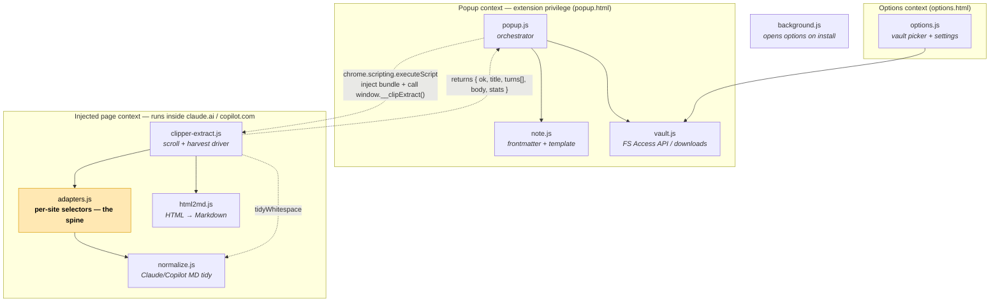
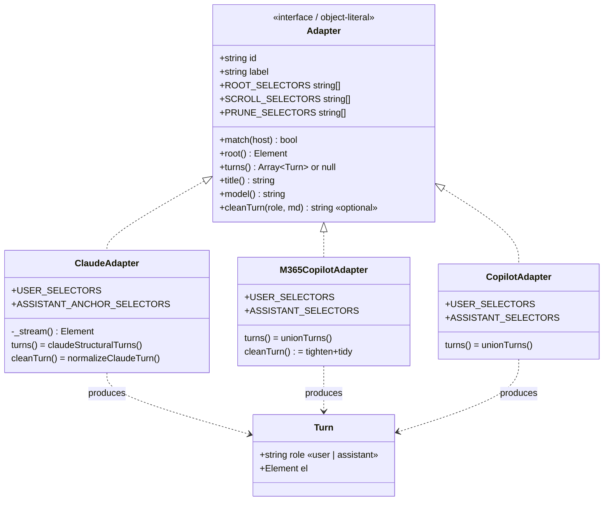

# Architecture Map — Obsidian Chat Clipper
_Generated 2026-07-01 · 10 JS modules, 0 classes (adapter object-literals + free functions) · Chrome/Edge MV3 extension_

> Note: this repo is JavaScript, not Python, so the cartographer's `analyze.py`
> (Python-AST) doesn't apply. The maps below were built by reading source
> directly and verifying every cross-file edge. Where the call graph is dynamic
> (string-injected scripts, `window.__clip*` globals), that's called out in
> **Notes & gaps** — those edges are real but invisible to any static resolver.

## What this is

A Manifest-V3 browser extension that captures a **Claude.ai** or **Microsoft
Copilot** conversation from the open tab and turns it into a clean, pre-scaffolded
Obsidian Markdown note. One click auto-scrolls the chat to force lazy-rendered
turns into the DOM, harvests each turn to Markdown, wraps it in YAML frontmatter +
a notes/highlights template, and writes it to a vault folder (File System Access
API) or downloads it.

Architecturally it's a **pipeline split across two isolated execution contexts**.
The *popup context* (extension privilege) orchestrates and owns output; the
*injected page context* (runs inside claude.ai / copilot) owns DOM extraction.
They share no variables — the only bridge is `chrome.scripting.executeScript`,
which injects the page bundle and reads back a plain-object result. A **per-site
adapter registry** isolates all the brittle, churn-prone DOM selectors into one
file, so a site redesign is a one-selector edit rather than a code change.

## System map

Two bundles, two worlds. Solid arrows are in-context function calls; the dashed
arrow is the *only* cross-context channel (script injection + serialized return).



**Layers.**
- **Orchestration** — [popup.js](popup.js) is the entry point behind the toolbar
  button. It wires the three buttons (Clip / Copy / Diagnose), injects the page
  bundle, and drives the popup-side pipeline.
- **Extraction (in-page)** — [clipper-extract.js](clipper-extract.js) is the
  driver; [adapters.js](adapters.js) is the **spine** (every other page module
  leans on it for *what to select*); [html2md.js](html2md.js) and
  [normalize.js](normalize.js) are pure text transformers.
- **Output (popup-side)** — [note.js](note.js) builds the final `.md` string and
  filename; [vault.js](vault.js) persists it.
- **Config** — [options.js](options.js) + [vault.js](vault.js) own the vault
  folder handle and user settings.
- **Lifecycle** — [background.js](background.js) is a 6-line service worker that
  opens the options page on first install; it participates in no data flow.

**The spine is `adapters.js`.** It's the most-depended-on module in the page
context and the one file the README tells you to tune. Everything about "how do we
find the conversation on *this* site" lives there and nowhere else.

## Key components

There are no ES classes. The design's "objects" are the three **adapter literals**
inside the `ADAPTERS` array — each a uniform interface the extractor calls
polymorphically. This is a **strategy pattern**: `clipper-extract.js` is written
once against the adapter shape; each site plugs in its own selectors and hooks.



The pieces that carry the design:

- **The Adapter interface** — the contract `clipper-extract.js` relies on:
  `match/root/turns/title/model`, optional `cleanTurn`, plus selector-list
  properties. Selectors are *lists, most-specific-first* so a redesign usually
  means prepending one selector, not rewriting logic.
- **`ClaudeAdapter`** is the interesting one. Claude only reliably tags the *user*
  message (`data-testid="user-message"`); assistant replies have no stable hook.
  So instead of guessing an assistant selector, `_stream()` computes the
  conversation container from the user-message anchors (their common ancestor),
  and `claudeStructuralTurns()` reads the container's children *structurally* — a
  child holding a user-message is a user turn, any other child with real text is
  an assistant turn. This is what survives Claude's class/testid churn.
- **The two Copilot adapters** are simpler: they have stable testids for both
  roles, so `turns()` delegates to `unionTurns()`, which matches user and
  assistant selectors independently, dedupes, keeps outermost containers, and
  sorts by document position. `M365CopilotAdapter` is listed **first** so it wins
  over the consumer adapter for `*.cloud.microsoft` hosts.
- **`Turn` `{role, el}`** is the lingua franca between adapters and the extractor —
  every `turns()` returns this shape (or `null` to trigger whole-root fallback).

## How it flows

### Flow 1 — "Clip to Obsidian" (the main path)

This is the point of the extension. Note where execution crosses the
context boundary (steps 4–6 run *inside the page*, everything else in the popup).

```mermaid
sequenceDiagram
    autonumber
    actor User
    participant Popup as popup.js (popup ctx)
    participant Vault as vault.js
    participant Page as clipper-extract.js (page ctx)
    participant Adapter as adapters.js
    participant H2M as html2md.js + normalize.js
    participant Note as note.js

    User->>Popup: click "Clip to Obsidian"
    Note over Popup,Vault: ask vault permission NOW while the click is "fresh"
    Popup->>Vault: getVaultHandle() / hasPermission()
    Popup->>Vault: requestPermissionNow(handle)  (tolerated if it fails)
    Popup->>Page: executeScript(inject bundle) then window.__clipExtract()
    activate Page
    Page->>Adapter: pickAdapter(location.hostname)
    loop scroll top→bottom, settle, harvest
        Page->>Adapter: adapter.turns()  → [{role, el}]
        Page->>H2M: htmlToMarkdown(prune(el)) → adapter.cleanTurn()
    end
    Page-->>Popup: { ok, title, model, url, turns[], body, stats }
    deactivate Page
    Popup->>Note: buildNote(data, settings) → md
    Popup->>Note: buildFilename(data, settings) → name.md
    Popup->>Vault: writeNote(name, md)
    Vault-->>User: saved to vault  OR  downloaded to AI-Chats/
    Popup->>User: setStatus("Saved… (N turns)")
```

Walkthrough:

1. **Permission first, on a fresh click.** `$("clip")`'s handler
   ([popup.js:130](popup.js#L130)) immediately calls `getVaultHandle()` →
   `hasPermission()` → `requestPermissionNow()`. This *must* happen before the
   multi-second scroll, because the File System Access permission prompt requires
   live user-activation, which the scroll would burn. If it fails, we tolerate it
   and fall back to a download later.
2. **Inject the page bundle once.** `extract(tabId)`
   ([popup.js:60](popup.js#L60)) first probes whether `window.__clipExtract`
   already exists; if not, it injects `normalize.js, adapters.js, html2md.js,
   clipper-extract.js` **in that dependency order**. The guard exists because
   re-injecting files with top-level `const` throws "already declared" on the
   second click.
3. **Cross into the page.** A second `executeScript` calls `window.__clipExtract()`
   and awaits its resolved promise — this is the one channel between contexts. The
   return value is a plain serializable object.
4. **Pick the adapter.** In-page, `__clipExtract`
   ([clipper-extract.js:142](clipper-extract.js#L142)) calls `pickAdapter()` to
   match the hostname, then probes `adapter.turns()` to decide preferred vs.
   fallback path.
5. **Scroll + harvest (the hard part).** `collectByScrolling()`
   ([clipper-extract.js:75](clipper-extract.js#L75)) finds the scroll container,
   jumps to the top, then steps down ~80% of a viewport at a time with a 300 ms
   settle delay so lazy-mounted turns render. At each settle it `harvest()`s:
   for every `{role, el}` from `adapter.turns()` it computes a **text signature**
   for dedup, prunes chrome nodes (`pruneForConversion` clones so the live page is
   never mutated), converts via `htmlToMarkdown()`, and runs the adapter's
   `cleanTurn()` hook. Results accumulate in a `Map` keyed by signature. Stops
   after two confirmations at the bottom (or a 600-step safety cap), then sorts by
   captured vertical position and `dedupeAdjacent()` collapses partial/full
   duplicates of the same turn.
6. **Assemble the body.** Each turn becomes `## 🧑 You` / `## 🤖 Assistant` +
   Markdown; `tidyWhitespace()` collapses blank-line bloat. If the adapter exposed
   *no* turn selectors, the **fallback path** scrolls to force render, then dumps
   `htmlToMarkdown(root)` as one unlabelled block. The resolved object carries
   `ok, title, model, url, turns[], body, stats`.
7. **Back in the popup: build the note.** `buildNote()`
   ([note.js:7](note.js#L7)) prepends YAML frontmatter (title/source/model/url/
   created/tags) and the fixed scaffold — `> [!note] My notes` callout,
   `## ⭐ Highlights`, `## Transcript` — then appends `data.body`.
   `buildFilename()` applies the `{date} {title}` pattern and strips
   filesystem-illegal characters.
8. **Persist.** `writeNote()` ([vault.js:69](vault.js#L69)) *queries* (never
   prompts) permission on the stored handle; if granted it writes via the FS
   Access API, otherwise it `chrome.downloads.download()`s into `AI-Chats/`. The
   returned `method` drives the final status message.

### Flow 2 — "Diagnose" (selector troubleshooting)

The `$("diag")` handler ([popup.js:96](popup.js#L96)) injects the same bundle and
calls `window.__clipDiagData()` → `clipDiagCompute()`
([clipper-extract.js:220](clipper-extract.js#L220)), which reports which
ROOT/SCROLL selectors matched, user/assistant turn counts, every `data-testid` on
the page, and the top class names inside root. `formatDiag()` renders it to text
and copies it to the clipboard — the intended workflow is "paste this to Claude to
get told which selector to add." This is why the README's tuning loop works
without the developer ever seeing the live page.

### Flow 3 — Options / vault setup

`options.js` `load()` restores settings and shows vault state.
`$("pickVault")` calls `window.showDirectoryPicker()` and, on grant,
`saveVaultHandle()` → `idbSet()` persists the directory handle in IndexedDB
([vault.js:8](vault.js#L8)). `$("regrant")` re-requests permission after a browser
restart (handles expire). `$("save")` writes `{tags, filenamePattern}` to
`chrome.storage.local`.

## Where to start

Read in this order — it follows the data:

1. **[README.md](README.md)** — the mental model + the selector-tuning workflow
   that explains why `adapters.js` is shaped the way it is.
2. **[adapters.js](adapters.js)** — the spine. Understand the Adapter interface
   and the Claude *structural-turns* trick and the rest falls into place.
3. **[clipper-extract.js](clipper-extract.js)** — the scroll-and-harvest driver;
   `collectByScrolling()` is the core algorithm.
4. **[popup.js](popup.js)** — the orchestrator; shows the two-context boundary and
   the permission-timing dance.
5. **[note.js](note.js)** + **[vault.js](vault.js)** — the short, self-contained
   output tail.

`html2md.js` and `normalize.js` are pure transformers — read them last, only when
you care about conversion fidelity.

## Notes & gaps

- **Cross-context edges are invisible to static analysis.** The
  popup→page call is a *string of filenames* handed to
  `chrome.scripting.executeScript` plus `window.__clipExtract` /
  `__clipDiagData` globals. No call-graph tool (Python or JS) will draw the
  `popup.js → clipper-extract.js` edge; it's verified here by reading both sides.
- **Two disjoint scopes, easy to trip on.** `note.js`/`vault.js` exist only in the
  popup; `adapters.js`/`html2md.js`/`normalize.js` only in the page. The
  `typeof tidyWhitespace === "function"` guard in
  [clipper-extract.js:171](clipper-extract.js#L171) exists precisely because that
  function's presence is context-dependent. Don't assume a function is callable
  across the boundary.
- **The selectors are the fragile part, by design.** Every `*_SELECTORS` list
  targets unofficial, churning markup (Claude, consumer Copilot, M365 Copilot).
  The code is built to degrade gracefully — structural fallback for Claude,
  whole-root dump when no turn selectors match — but "empty/messy clip" almost
  always means a selector in `adapters.js` went stale, not a logic bug. Use
  `__clipDiag()`.
- **`PRUNE_SELECTORS` are best-guess.** The Claude tool-use/artifact prune
  selectors are explicitly flagged in-source as unverified against live DOM; until
  one matches, those chrome artifacts leak into the clip.
- **Timing constants are heuristic.** The 300 ms settle delay, 80%-viewport step,
  and 2-confirmation bottom detection in `collectByScrolling()` are tuned for
  "good enough," not guaranteed — very long or very slow-rendering chats could
  under-harvest before the 600-step cap.
- **No build/tests/deps.** Plain ES, no bundler, no `package.json`, no test
  suite; loaded unpacked. Nothing was skipped for parse errors — the whole
  surface is covered above.
```
