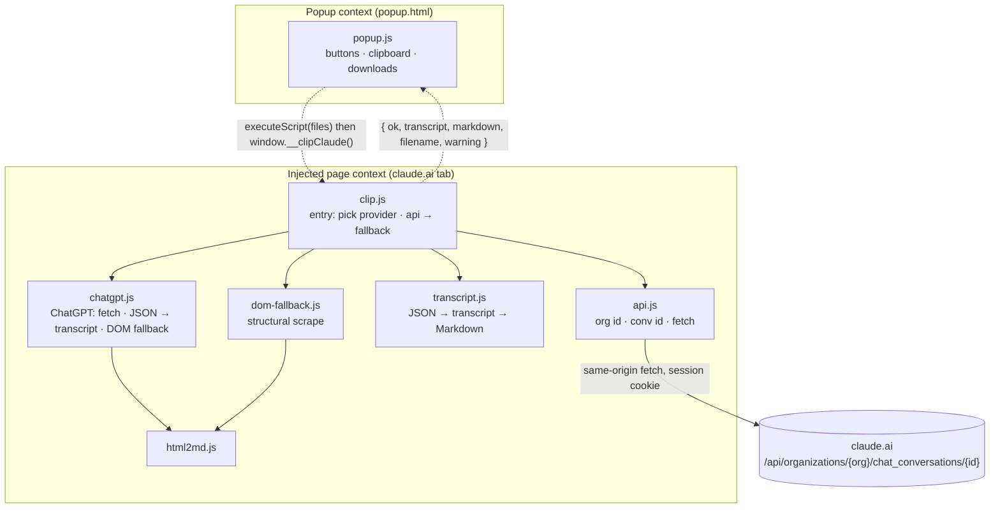
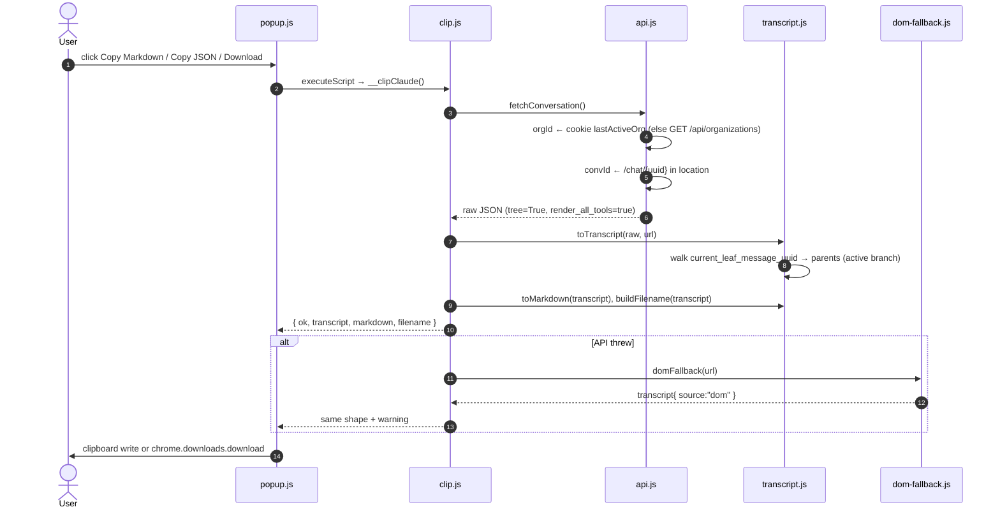

# Architecture — Claude Chat Clipper

_Updated 2026-09-07 · 8 JS files, no build step · Chrome/Edge MV3 extension_

## What this is

A Manifest-V3 extension that exports the open claude.ai or ChatGPT conversation
as Markdown or JSON. The previous design scraped the rendered DOM while
auto-scrolling; it dropped turns because assistant replies have no stable
selector and the page virtualises and streams. This design fetches the
conversation JSON from claude.ai's own endpoint and only touches the DOM as a
fallback.

## System map

Two execution contexts. The popup has extension privilege; the page bundle runs
inside the claude.ai tab. The only bridge is `chrome.scripting.executeScript`.



`clip.js` holds a small provider table keyed by hostname. The Claude provider
is the original `api.js` / `transcript.js` / `dom-fallback.js` trio; the ChatGPT
provider is the single file `chatgpt.js`, which emits the same transcript shape
so `toMarkdown` and `buildFilename` are shared. The transcript carries an
`assistant` label ("Claude" or "ChatGPT") used for the reply heading.

All page files are IIFEs that attach functions to `window.__claudeClipper`.
There are no top-level `const`s in page scope, so re-injection cannot throw
"already declared". `popup.js` still probes `typeof window.__clipClaude` to
avoid injecting twice per page load.

## Flow



## Data shapes

**Transcript** (what "Copy as JSON" emits):

```
{ schema: 1, source: "api" | "dom", assistant: "Claude" | "ChatGPT",
  title, model, url, conversationId,
  createdAt, updatedAt, clippedAt, warning?,
  turns: [{ uuid, role: "user" | "assistant", timestamp,
            blocks: [ ...raw content blocks... ], attachments: [name] }] }
```

Blocks are passed through verbatim from the API (`text`, `thinking`,
`tool_use`, `tool_result`), so the JSON is a complete archive. The DOM fallback
produces one `text` block per turn.

**Markdown** (`toMarkdown`): title, source/model/date lines, then per turn a
`## 🧑 You` or `## 🤖 Claude` heading. `text` blocks are emitted as-is.
Artifact `tool_use` ops are folded per artifact id (create / rewrite replace,
update applies `old_str → new_str`) and each turn renders the artifacts it
touched once, as they stood at the end of that turn. Other tool_use blocks
become `_Used tool: name_`. Thinking and tool_result are skipped. Fences grow
past any backtick run in the content.

## DOM fallback

`dom-fallback.js` keeps the one selector Claude has been stable on,
`div[data-testid="user-message"]`, finds the common ancestor of those rows, and
climbs until the candidate holds at least two rows and an assistant action bar.
That climb fixes the old single-message bug where the "common ancestor" of one
user message was the message itself. Every other child row with text is an
assistant turn. It runs once, with `textContent`, without scrolling. Artifact
and tool cells become a placeholder paragraph instead of being pruned to empty.

## ChatGPT provider

`chatgpt.js` reads the bearer token from `/api/auth/session`, then fetches
`/backend-api/conversation/{id}` (the id is `/c/<uuid>` in the path, also under
custom-GPT `/g/…/c/<uuid>` URLs). The payload is a `mapping` of nodes plus a
`current_node` leaf; it walks parents to the root, keeps `user` and `assistant`
messages that are not hidden, and merges adjacent same-role nodes (reasoning
and answer arrive as separate nodes). `text` / `multimodal_text` parts become
`text` blocks; every other `content_type` is passed through for the JSON and
skipped in Markdown. The DOM fallback uses `[data-message-author-role]`, which
tags both roles, so no structural climb is needed.

## Where to start

1. `transcript.js` — the whole product is here; pure functions, tested in
   `test/transcript.html`.
2. `api.js` — the endpoint and how ids are derived. If claude.ai changes, this
   is the file. `chatgpt.js` is the equivalent for chatgpt.com.
3. `popup.js` — the two-context boundary and the three actions.
4. `dom-fallback.js` / `html2md.js` — only when the fallback is in play.

## Known gaps

- The endpoint and its field names are unofficial. `test/transcript.html`
  section B exists so a recorded response can confirm them after a change.
- Attachments are listed by filename; contents are not fetched.
- The fallback cannot see artifact contents and inherits the fragility of any
  selector-based approach.
